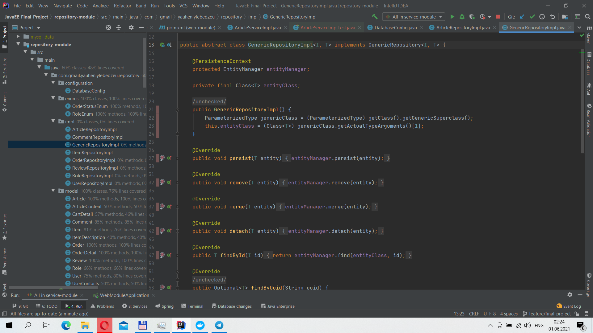
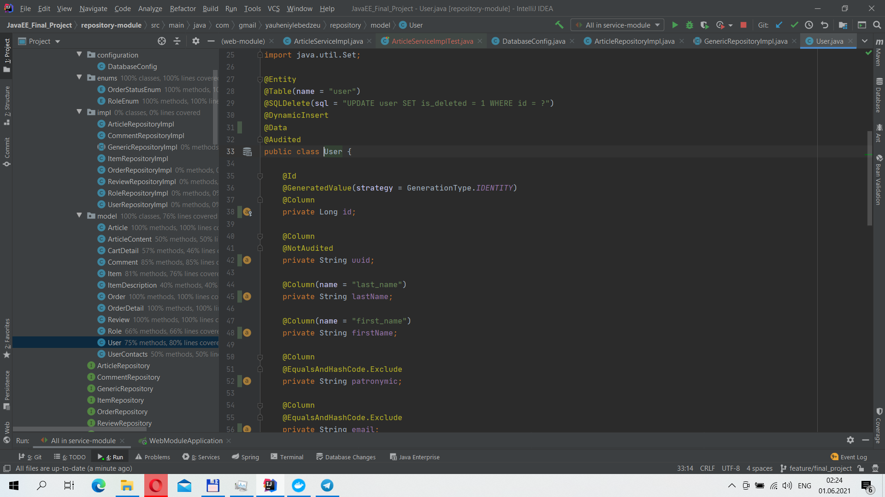
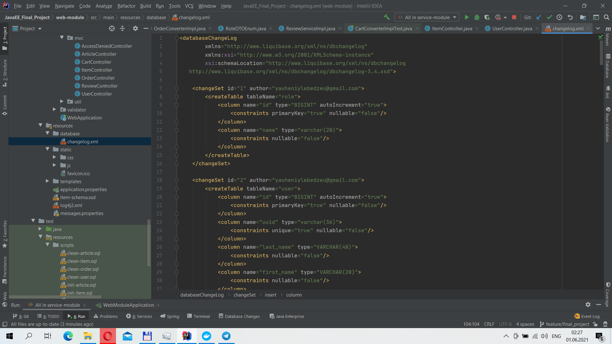
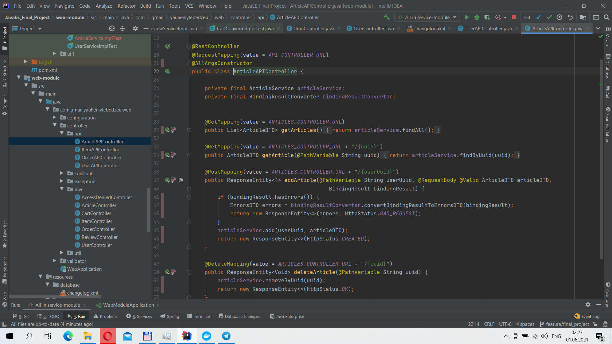

# JavaEE Final Project
> The project was made as part of the course "Technologies for developing enterprise solutions in Java".
  It is an online store with the ability to put products in the basket, select their quantity and place an order. There 
>is also a news page where you can leave a comment, and there is also a review page. 
> Live demo [_here_](https://javaeefinalproject.herokuapp.com).

## Table of Contents
* [General Info](#general-information)
* [Technologies Used](#technologies-used)
* [Features](#features)
* [Screenshots](#screenshots)
* [Setup](#setup)
* [Usage](#usage)
* [Project Status](#project-status)
* [Room for Improvement](#room-for-improvement)
* [Acknowledgements](#acknowledgements)
* [Contact](#contact)
<!-- * [License](#license) -->

## General Information
- Provide general information about your project here.
- What problem does it (intend to) solve?
- What is the purpose of your project?
- Why did you undertake it?
<!-- You don't have to answer all the questions - just the ones relevant to your project. -->

## Technologies Used
- Java 11
- Spring Boot 2.4.2
- Spring Security
- Hibernate
- Thymeleaf
- Lombock 1.18.16
- Jackson Dataformat Xml 2.11.4
- Docker Desktop 3.3.3
- Springfox Swagger 3.0.0 
- Git
- Maven

## Features
List the ready features here:
- [_The first part_](https://docs.google.com/document/d/1SDiIRVNyiorPQv05CUjIs-vC6XMAJY9Lcq8jraLif7U/edit?usp=sharing)
- [_The second part_](https://docs.google.com/document/d/1xOdGZVrnr9QX1uuCgEbfJFOCoB7pFhJ0F70lLd_SRqM/edit?usp=sharing)
- [_The third part_](https://docs.google.com/document/d/1ME_URe6wJBLI1IOZs5kUa1rax_IoZLLembhE69zRQwI/edit?usp=sharing)
- [_The fourth part_](https://docs.google.com/document/d/1BKwqUX6-19eb_eZgdgO6-KdrOeyeBkk__GZLEjBoi0c/edit?usp=sharing)

## Screenshots

<!-- If you have screenshots you'd like to share, include them here. -->

## Setup
Using Maven, build the project (mvn clean package command), then run the docker-compose file with the following settings:
version: "3.3"
  services:
  db_mysql:
    image: mysql:latest
    restart: always
    container_name: mysql
    ports:
      - 3306:3306
    expose:
      - 3306
    environment:
      - MYSQL_DATABASE=final_project
      - MYSQL_ROOT_PASSWORD=1234
    volumes:
      - ./mysql-data:/var/lib/mysql
Then run the application and you can go to the url: http: // localhost: 8080 / 

## Usage
The program serves to demonstrate the skills mastered by the author and is intended for use for informational purposes.

## Project Status
Project is completed. But the improvement work continues.

## Room for Improvement
1. There is a goal to add the possibility of self-registration of new users. 
2. I would also like to add images of items to the database, and the ability to upload a user's photo to the profile.

## Acknowledgements
I would like to thank my teacher Artyom Perevoznikov for his excellent presentation of the material and for his
 invaluable help throughout the training. I would also like to thank my fellow students, who were also always ready
  to come to the rescue. And a special thank you to my wife Olga Lebedeva for her patience and understanding.

## Contact
Created by [Yauheni Lebedzeu](https://t.me/Lemot1987) - feel free to contact me!
